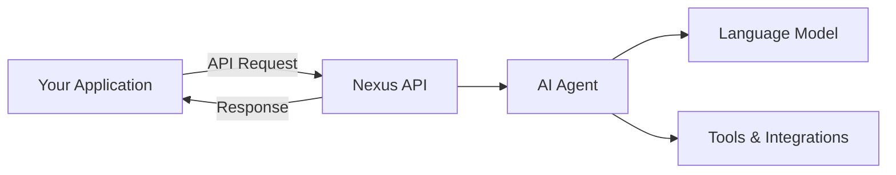

# Welcome to Nexus API

The Nexus API enables developers to integrate intelligent AI agents into their applications with just a few lines of code. Whether you're building a customer support system, an interactive assistant, or a complex conversational interface, Nexus provides the tools you need.

## What is Nexus?

Nexus is a powerful platform for creating and deploying AI agents that can:

- Understand context and maintain conversation history
- Execute tools and integrations
- Process complex queries with reasoning capabilities
- Scale to handle multiple concurrent sessions

## Quick Start

<CardGroup cols={2}>
  <Card title="Get Started in 5 Minutes" icon="rocket" href="/quickstart">
    Create your first chat session and send messages with our quickstart guide
  </Card>

  <Card title="Authentication" icon="key" href="/authentication">
    Set up your API key and learn about security best practices
  </Card>
</CardGroup>

## Core Features

<CardGroup cols={2}>
  <Card title="Easy Integration" icon="plug">
    Simple REST API that works with any programming language. Get started in
    minutes with our SDKs.
  </Card>

  <Card title="Intelligent Agents" icon="brain">
    Powered by advanced AI models that understand context and provide meaningful
    responses.
  </Card>

  <Card title="Real-time Conversations" icon="messages">
    Support for synchronous and asynchronous messaging with low latency
    responses.
  </Card>

  <Card title="Secure & Scalable" icon="shield">
    Enterprise-grade security with API key authentication and automatic scaling.
  </Card>
</CardGroup>

## Popular Use Cases

### Customer Support

Deploy AI agents to handle customer inquiries, troubleshoot issues, and escalate when necessary.

### Virtual Assistants

Create intelligent assistants that can help users with tasks, answer questions, and provide recommendations.

### Interactive Applications

Build conversational interfaces for your applications that feel natural and responsive.

### Process Automation

Automate workflows by integrating AI agents with your existing tools and systems.

## Explore the Documentation

<CardGroup cols={2}>
  <Card
    title="API Reference"
    icon="code"
    href="/api-reference/nexus-endpoints/create-session"
  >
    Detailed documentation for all API endpoints
  </Card>

  <Card title="SDK Examples" icon="book" href="/sdk-examples">
    Complete code examples in multiple languages
  </Card>

  <Card
    title="Error Handling"
    icon="triangle-exclamation"
    href="/error-handling"
  >
    Learn how to handle errors gracefully
  </Card>

  <Card title="Best Practices" icon="star" href="/best-practices">
    Production-ready patterns and guidelines
  </Card>
</CardGroup>

## Architecture Overview

## Need Help?

<CardGroup cols={2}>
  <Card title="Support" icon="envelope" href="mailto:shady@gpt.nexus">
    Contact our support team for assistance
  </Card>

  <Card title="Dashboard" icon="gauge" href="https://gpt.nexus/App">
    Access your dashboard to manage API keys and monitor usage
  </Card>
</CardGroup>

---

Ready to get started? Head over to our [Quickstart Guide](/quickstart) to make your first API call in minutes!
