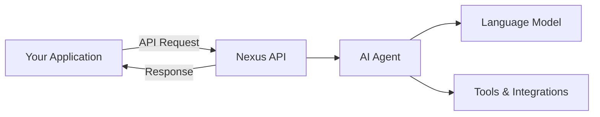

# Welcome to Nexus API

The Nexus API enables developers to integrate intelligent AI agents into their applications with just a few lines of code. Whether you're building a customer support system, an interactive assistant, or a complex conversational interface, Nexus provides the tools you need.

## What is Nexus?

Nexus is a powerful platform for creating and deploying AI agents that can:
- Understand context and maintain conversation history
- Execute tools and integrations
- Process complex queries with reasoning capabilities
- Scale to handle multiple concurrent sessions

## Key Features

<CardGroup cols={2}>
  <Card title="Easy Integration" icon="plug">
    Simple REST API that works with any programming language. Get started in minutes with our SDKs.
  </Card>
  
  <Card title="Intelligent Agents" icon="brain">
    Powered by advanced AI models that understand context and provide meaningful responses.
  </Card>
  
  <Card title="Real-time Conversations" icon="messages">
    Support for synchronous and asynchronous messaging with low latency responses.
  </Card>
  
  <Card title="Secure & Scalable" icon="shield">
    Enterprise-grade security with API key authentication and automatic scaling.
  </Card>
</CardGroup>

## Use Cases

### Customer Support
Deploy AI agents to handle customer inquiries, troubleshoot issues, and escalate when necessary.

### Virtual Assistants
Create intelligent assistants that can help users with tasks, answer questions, and provide recommendations.

### Interactive Applications
Build conversational interfaces for your applications that feel natural and responsive.

### Process Automation
Automate workflows by integrating AI agents with your existing tools and systems.

## Architecture Overview



## Getting Started

<Steps>
  <Step title="Create Account">
    Sign up for a Nexus account at [nexusgpt.io](https://nexusgpt.io)
  </Step>
  
  <Step title="Configure Agent">
    Create and configure your AI agent in the Nexus dashboard
  </Step>
  
  <Step title="Generate API Key">
    Create an API integration and generate your authentication key
  </Step>
  
  <Step title="Make First Call">
    Use our API to create a session and start chatting
  </Step>
</Steps>

## Quick Example

Here's how simple it is to get started:

```javascript
const response = await fetch('https://api.nexusgpt.io/api/public/thread', {
  method: 'POST',
  headers: {
    'Content-Type': 'application/json',
    'api-key': 'YOUR_API_KEY'
  },
  body: JSON.stringify({
    message: 'Hello, how can you help me today?'
  })
});

const session = await response.json();
console.log('Session created:', session.id);
```

## What's Next?

<CardGroup cols={2}>
  <Card title="Quickstart Guide" icon="rocket" href="/quickstart">
    Get up and running with the Nexus API in 5 minutes
  </Card>
  
  <Card title="Authentication" icon="key" href="/authentication">
    Learn about API keys and security best practices
  </Card>
  
  <Card title="API Reference" icon="code" href="/api-reference">
    Explore all available endpoints and parameters
  </Card>
  
  <Card title="SDK Examples" icon="book" href="/sdk-examples">
    Find examples in your preferred programming language
  </Card>
</CardGroup>

## Need Help?

- **Documentation**: You're in the right place!
- **Support**: Email us at shady@gpt.nexus
- **Dashboard**: Access your account at [gpt.nexus](https://gpt.nexus)